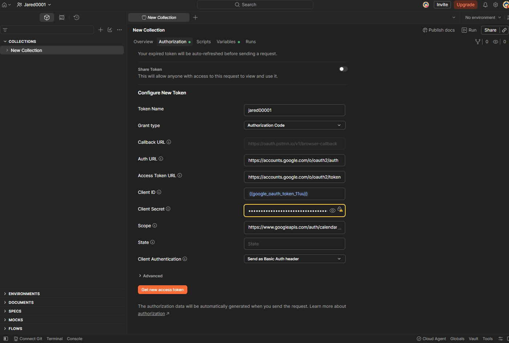

# Google OAuth 2.0 in Postman: Mini Case Study

## Overview
This project documents how I configured and debugged a Google OAuth 2.0 flow in Postman so I could make authenticated API requests with a Bearer token instead of relying on manual credentials. The final result was a working Authorization Code flow where Google returned an authorization code to Postman, Postman exchanged it for tokens, and the collection was ready to call the API.

## Goal
The goal was to connect Postman to a Google API using OAuth 2.0 with the correct scope, the correct redirect URI, and a valid user account that was authorized to test the app. Because OAuth is permission-based, the request only works when the client configuration, redirect URI, consent screen, and approved user all line up correctly.

## Setup
I configured Postman to use the **Authorization Code** grant type with Google's authorization endpoint and token endpoint, then supplied the client ID, client secret, redirect URI, and requested scope (`calendar.readonly`). Postman's web app uses `https://oauth.pstmn.io/v1/browser-callback` as its browser callback, so that exact value must be registered as an authorized redirect URI in Google Cloud Console.

*Postman's OAuth 2.0 configuration screen showing grant type, endpoints, and scope.*

## Issue 1: Redirect URI mismatch
The first failure was `redirect_uri_mismatch`. This means the redirect URI sent in the request did not exactly match an authorized redirect URI in the Google Cloud OAuth client settings. Google treats the redirect URI as part of the security boundary, so even a small mismatch prevents the authorization server from returning the code.

**What I changed:** I opened the OAuth client in Google Cloud Console and added Postman's browser callback URI (`https://oauth.pstmn.io/v1/browser-callback`) exactly as required under Authorized Redirect URIs.

## Issue 2: Access denied in testing mode
After the redirect URI was fixed, the flow moved forward, but Google then returned `access_denied` because the app was still in **Testing** publishing status. Google restricts unverified apps in testing mode so they can only be accessed by users explicitly added under **Test users** on the OAuth consent screen.

**What I changed:** I added the Google account I wanted to use as a test user on the OAuth consent screen.

## Working result
Once both configuration issues were fixed, the OAuth flow completed successfully: sign in with Google, approve the requested permissions, return to Postman with an authorization code, and exchange that code for tokens.

*Google's callback confirming authentication completed successfully.*

*Postman's Current Token panel showing the retrieved access token, ready to authenticate requests with a Bearer header.*

## What this shows
This exercise demonstrates more than just getting a request to work. It shows an understanding of how OAuth depends on exact redirect URI matching, consent screen configuration, testing restrictions, and scoped permissions before an API client can act on a user's behalf.

## OAuth terms in plain English

### Authorization Code Grant
A flow designed for apps where a human logs in and approves access. Rather than issuing a token directly, the authorization server first returns a short-lived, single-use *code* to the browser. The client then exchanges that code for a token via a separate, direct backend call. This is safer than returning the final token directly through the browser.

### Access Token
The credential an app attaches to every API request (typically as a `Bearer` token in the Authorization header) to prove it has permission to act on a user's behalf. Access tokens are intentionally short-lived, often just an hour, to limit the damage if one is ever leaked.

### Refresh Token
A longer-lived credential issued alongside the access token, used to obtain a new access token once the current one expires, without requiring the user to log in and consent again.

### Scope
A permission string defining exactly what an access token can do. `calendar.readonly` only allows reading calendar data, no writing, no deleting. Scopes enforce the principle of least privilege, and the user sees precisely what they're granting on the consent screen before approving.

## Interview value
In an interview, this project demonstrates both implementation and understanding: configuring OAuth in a real client, diagnosing common Google OAuth failures, and explaining why the flow works once the redirect URI, test-user access, and requested scope are configured correctly. That makes the project stronger than a simple "it works" demo because it shows troubleshooting and security awareness.

---

See [oauth2-case-study.md](oauth2-case-study.md) for the extended write-up.
